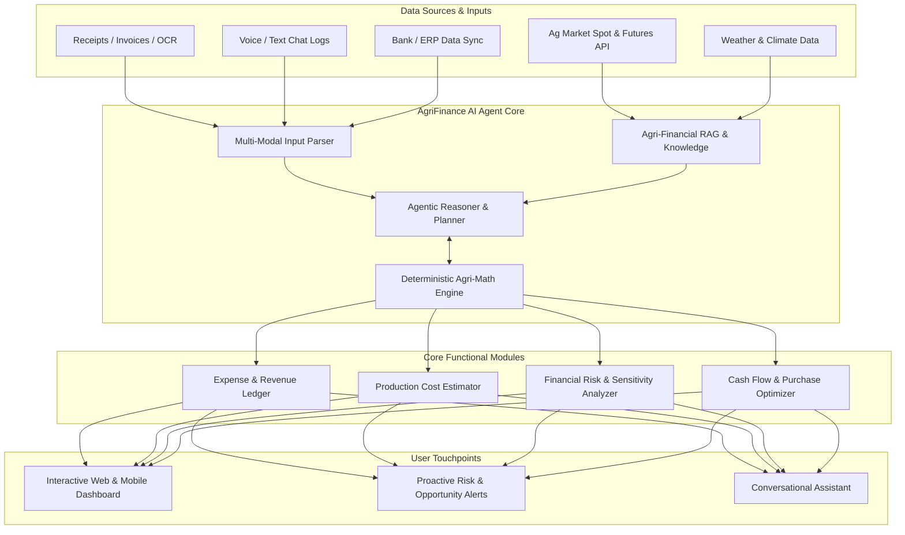
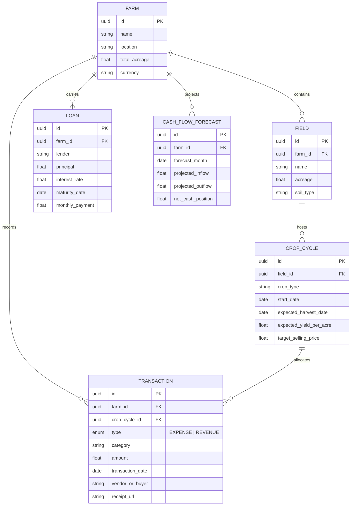
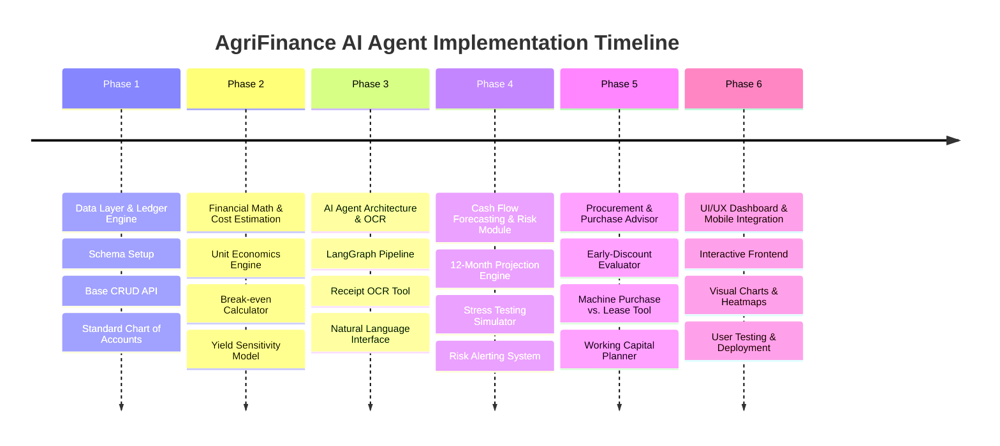

# AgriFinance AI Agent: Technical Blueprint & Development Plan

An end-to-end plan for developing **AgriFinance AI**, an autonomous financial management agent designed specifically for agricultural producers, crop growers, and livestock farmers.

---

## Executive Summary & System Objectives

Agricultural operations face unique financial challenges: high seasonal volatility, long production cycles, heavy upfront capital expenditure, climate/yield uncertainty, and fluctuating commodity market prices. Standard accounting software fails to capture agricultural nuances such as field-level cost accounting, crop cycle amortization, and yield-sensitive break-even analysis.

**AgriFinance AI** bridges this gap by combining **deterministic financial computation** with **agentic AI reasoning**, vision capabilities for receipt parsing, and predictive scenario modeling.



---

## 1. Key Functional Requirements

### 1.1 Expense & Revenue Tracking
- **Multi-Modal Data Ingestion**: Receipt photo scanning via OCR (Tesseract / Gemini Vision), voice notes ("Bought 50 bags of NPK fertilizer for $2,200 from Agway"), CSV/Excel imports, and bank API integration (Plaid/Yodlee).
- **Agricultural Chart of Accounts**: Automated tagging across categories:
  - *Direct Expenses*: Seeds, fertilizers, chemicals/pesticides, irrigation water, fuel, crop insurance, seasonal labor.
  - *Indirect / Overhead*: Machinery depreciation, land lease, loan interest, maintenance, utilities.
  - *Revenue*: Harvest crop sales, forward contracts, livestock, government subsidies (e.g., USDA programs), crop insurance claims.
- **Granular Allocation**: Attribute transactions down to specific **Farm Plot**, **Field**, **Crop Season**, or **Livestock Batch**.

### 1.2 Production Cost Estimation
- **Unit Economics Calculation**: Calculates Cost per Acre/Hectare, Cost per Bushel/Ton/Pound, and Cost per Animal.
- **Fixed vs. Variable Cost Breakdown**: Differentiates sunk operational costs from variable harvest costs.
- **Yield-Adjusted Cost Sensitivity**: Dynamically calculates unit cost under varying yield scenarios (e.g., 80%, 100%, 120% of expected yield).

### 1.3 Financial Risk Identification
- **Break-Even Price & Yield Analysis**: Real-time calculation of minimum selling price needed to cover cash costs vs. total unit cost.
- **Debt Service Coverage Ratio (DSCR)**: Tracks debt obligations against projected operating income.
- **Sensitivity & Stress Testing**:
  - *Market Price Drop*: Impact of -15% drop in corn/soybean futures.
  - *Input Price Spike*: Impact of +25% rise in diesel/fertilizer cost.
  - *Yield Deficit*: Drought/weather impact simulation.
- **Liquidity Warning Engine**: Early detection of negative cash balance windows 30 to 180 days in advance.

### 1.4 Purchase & Cash Flow Planning
- **Agricultural Cash Flow Forecasting**: Alignment of inflows (harvest/sale months) with outflows (planting/input purchase months).
- **Procurement Timing Optimizer**: Evaluates early-bird input discounts vs. financing costs (holding costs & interest).
- **Capex ROI Evaluator**: Buying vs. leasing machinery (e.g. tractor, combine harvester) or investing in capital upgrades (e.g. modern drip irrigation system).

---

## 2. Technical Architecture & Tech Stack

```mermaid
flowchart LR
    subgraph Client Layer
        Web[React / Vite + Tailwind PWA]
        Mobile[React Native / Mobile App]
    end

    subgraph API & Gateway Layer
        FastAPI[FastAPI Gateway]
        Auth[JWT / OAuth2 Security]
    end

    subgraph Intelligence & Agent Layer
        Agent[LangGraph / Agent Protocol Engine]
        Tools[Custom Toolset: Math, OCR, Market APIs]
        LLMProvider[LLM Provider: Gemini / Claude / OpenAI]
    end

    subgraph Data Layer
        DB[(PostgreSQL + TimescaleDB)]
        VectorStore[(pgvector / Qdrant)]
        Cache[(Redis Cache & Task Queue)]
    end

    Client Layer --> API & Gateway Layer
    API & Gateway Layer --> Agent
    Agent <--> Tools
    Agent <--> LLMProvider
    Agent <--> Data Layer
```

| Component | Recommended Stack | Rationale |
| :--- | :--- | :--- |
| **Frontend UI** | React 18, Vite, TypeScript, Tailwind CSS, Recharts | Fast, responsive, rich dynamic charts for financial curves & scenario heatmaps. |
| **Backend API** | Python 3.11+, FastAPI, Pydantic | High performance, native integration with data science & LLM frameworks. |
| **Agent Framework** | LangGraph / LlamaIndex / Custom State Machine | Robust stateful agent execution with multi-step tool call verification. |
| **Database** | PostgreSQL + TimescaleDB (Time-series data) | Excellent relational schema for financial ledger + time-series tracking. |
| **Vector DB** | `pgvector` extension | Native vector search for crop guides, market reports, and tax regulations. |
| **Task Queue** | Celery + Redis | Asynchronous receipt processing, scenario simulations, and background alerts. |
| **OCR & Vision** | Gemini 1.5 Flash Vision / Tesseract | Accurate extraction of line items, totals, vendors, and dates from handwritten or printed invoices. |

> [!IMPORTANT]
> **Deterministic Financial Safeguard**: LLMs should never calculate mathematical totals directly. All financial math (DSCR, break-even, net NPV, cash flow aggregation) must be executed by validated Python math tools, with the LLM serving as the intent interpreter, tool orchestrator, and report synthesizer.

---

## 3. Data Schema Model (Core Entities)



---

## 4. Agent Toolset Specifications

The AI agent will be equipped with specialized, deterministic tools:

1. `parse_receipt(image_path: str) -> TransactionDraft`
   - Uses Vision LLM to extract vendor, line items, tax, total, and suggested agricultural expense category.
2. `compute_production_cost(crop_cycle_id: str) -> ProductionCostReport`
   - Sums direct & indirect expenses, computes cost per acre and cost per unit output based on target yield.
3. `calculate_break_even(crop_cycle_id: str, yield_scenarios: List[float]) -> BreakEvenTable`
   - Calculates break-even price per unit for different yield outcomes ($ / bushel or $ / ton).
4. `run_sensitivity_simulation(farm_id: str, price_delta_pct: float, input_cost_delta_pct: float) -> RiskReport`
   - Runs stress tests on cash flow under adverse market conditions.
5. `project_cash_flow(farm_id: str, months_ahead: int = 12) -> CashFlowSchedule`
   - Combines recurring debt, planned crop inputs, projected harvest revenue, and historic overhead to build month-by-month cash balances.
6. `fetch_market_prices(commodity: str, location: str) -> MarketPriceData`
   - Queries current spot & futures market prices from ag data sources.

---

## 5. Phased Execution Roadmap



### Phase 1: Data Architecture & Financial Ledger Engine
- [ ] Define PostgreSQL database schemas (Farms, Fields, Crop Cycles, Transactions, Loans).
- [ ] Implement robust REST API for managing financial transactions.
- [ ] Pre-populate standardized agricultural Chart of Accounts (Seeds, Fertilizer, Chemical, Fuel, Machinery, Labor, Sales, Grants).
- [ ] Build CSV/Excel importer for historic accounting data.

### Phase 2: Production Cost & Unit Economics Engine
- [ ] Implement `ProductionCostEngine` service in Python.
- [ ] Build cost-per-acre and cost-per-unit metrics calculator.
- [ ] Implement fixed vs. variable expense tagging logic.
- [ ] Build dynamic yield-sensitive break-even matrix generator.

### Phase 3: AI Agent Core & OCR Receipt Ingestion
- [ ] Build receipt scanner pipeline using multimodal LLM (extracting line items & auto-categorization).
- [ ] Configure Agent State Machine (LangGraph) with strict financial tool validation.
- [ ] Build conversational prompt system with domain-specific agricultural context.
- [ ] Implement audit trail for agent recommendations.

### Phase 4: Cash Flow Forecasting & Financial Risk Analyzer
- [ ] Build 12-month rolling cash flow forecasting algorithm tailored to crop harvest cycles.
- [ ] Implement Debt Service Coverage Ratio (DSCR) and liquidity bottleneck detector.
- [ ] Build Monte Carlo / Sensitivity stress testing module (price drops, yield losses, cost spikes).
- [ ] Create automated push notification / alert service for upcoming cash crunches.

### Phase 5: Purchase Planning & Procurement Advisor
- [ ] Build input purchase timing optimization tool (evaluating cash discounts vs loan financing rates).
- [ ] Implement Capital Expenditure (CapEx) buying vs. leasing ROI comparison model.
- [ ] Develop loan repayment optimization advisor.

### Phase 6: Interactive Dashboard UI & End-to-End Integration
- [ ] Build modern React dashboard with interactive charts (Recharts) for cash flow, break-even curves, and field profitability.
- [ ] Integrate chat drawer allowing seamless conversation with the AI agent.
- [ ] Implement visual risk heatmaps (Red/Yellow/Green liquidity indicators).
- [ ] Conduct end-to-end testing with sample multi-crop farm dataset.

---

## 6. Financial Risk Matrix & Mitigation Strategies

| Potential Risk | Severity | Impact | Mitigation Strategy |
| :--- | :---: | :---: | :--- |
| **LLM Math Hallucination** | **High** | Critical financial errors | All calculations executed via strict, unit-tested Python functions; LLM only reads output. |
| **Unpredictable Weather / Yield Variance** | **High** | Revenue miscalculation | Force dynamic range-based forecasting (Pessimistic, Base, Optimistic scenarios). |
| **Poor Internet Access on Remote Farms** | **Medium** | App unusable in field | Implement PWA with local SQLite/IndexedDB caching; sync transactions when reconnected. |
| **Inaccurate Receipt Parsing** | **Medium** | Misclassified expenses | Show user interactive confirmation modal to verify/correct extracted receipt items. |

---

## 7. Next Steps & Recommended Actions

> [!TIP]
> To turn this plan into code, we can start with **Phase 1** by setting up the project structure, database models, and agricultural financial ledger backend.

- **Option A**: Proceed with creating the project blueprint / initial backend models (`models.py`, `schemas.py`, `ledger.py`).
- **Option B**: Create a mock prototype UI in the existing React framework to demonstrate the Cash Flow Planner and AI Agent Chat drawer.
